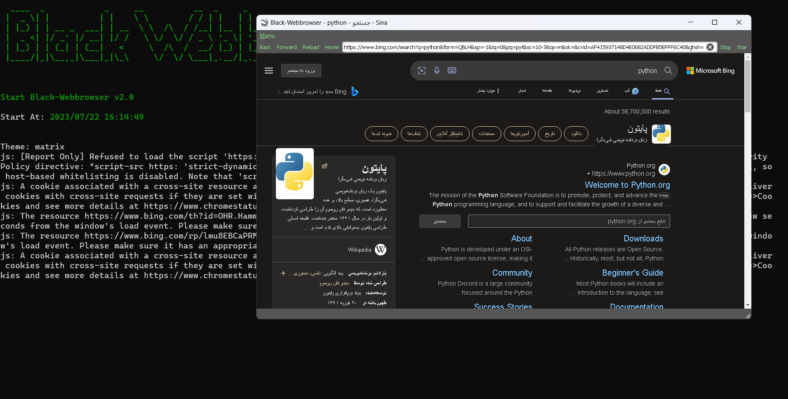
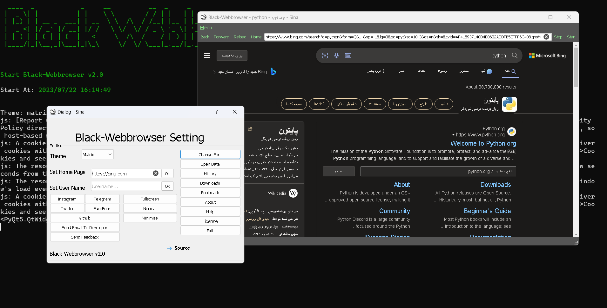

# Black-Webbrowser v2.0
### Made By Sina Meysami

<hr>

<center>

[](https://github.com/mrprogrammer2938/black-webbrowser)

</center><br>

``` txt
____  _            _     __          __  _     _                                     
|  _ \| |          | |    \ \        / / | |   | |                                     
| |_) | | __ _  ___| | __  \ \  /\  / /__| |__ | |__  _ __ _____      _____  ___ _ __ 
|  _ <| |/ _` |/ __| |/ /   \ \/  \/ / _ \ '_ \| '_ \| '__/ _ \ \ /\ / / __|/ _ \ '__|
| |_) | | (_| | (__|   <     \  /\  /  __/ |_) | |_) | | | (_) \ V  V /\__ \  __/ |   
|____/|_|\__,_|\___|_|\_\     \/  \/ \___|_.__/|_.__/|_|  \___/ \_/\_/ |___/\___|_|                                           
```
<br>

[](https://github.com/mrprogrammer2938/black-webbrowser)

[](https://github.com/mrprogrammer2938/black-webbrowser)
<br>

> Black-Webbrowser v2.0
> Black-Webbrowser is a search engine
> For Windows, Linux, Mac OS Platform
> Black Webbrowser A powerful and safe engine
>> Black Webbrowser Is Open Source


## Installing
``` bash
git clone https://github.com/mrprogrammer2938/black-webbrowser

cd black-webbrowser

bash install.sh

python black.py
```

### Argument
```
python black.py 
    --start = Start App
    --url <URL> = Search Website
    --help = Help
    --version = Version
```
<br>

[Github](https://github.com/mrprorammer2938 "Github")

[Instagram](https://instagram.com/sina.coder "Instagram")

[Twitter](https://twitter.com/Sinameysami "Twitter")
<br>


<br>

